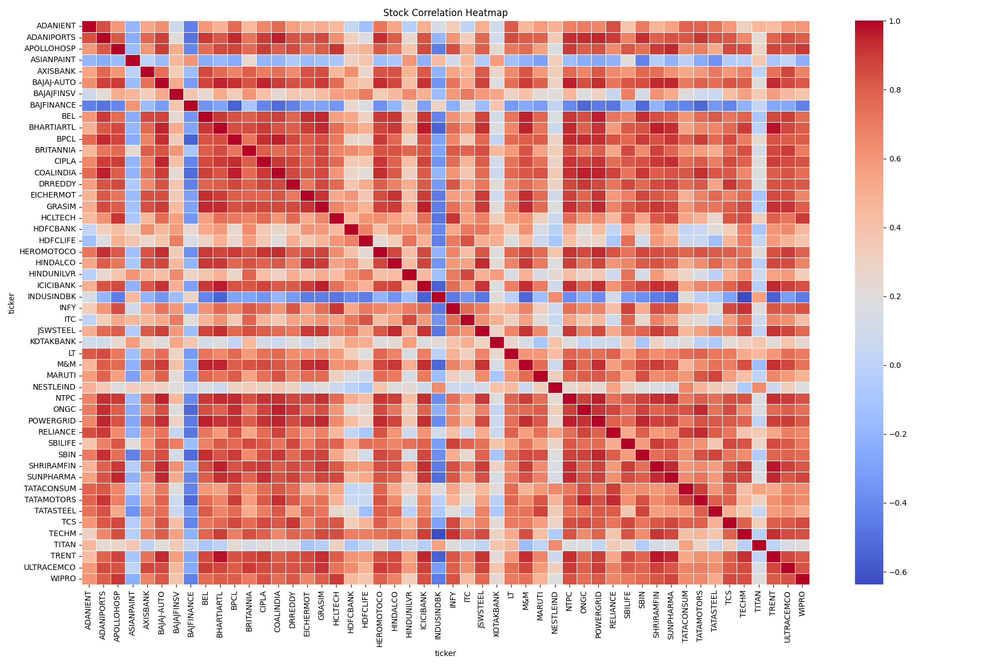
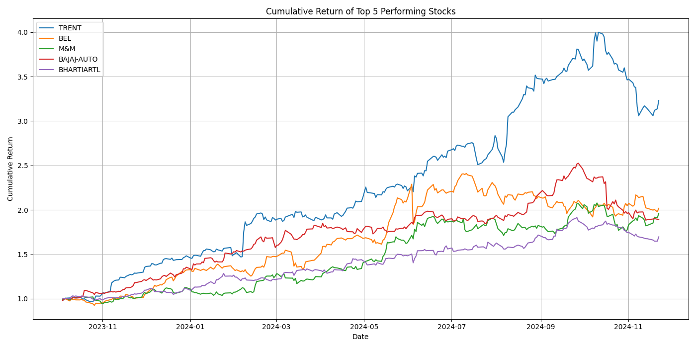
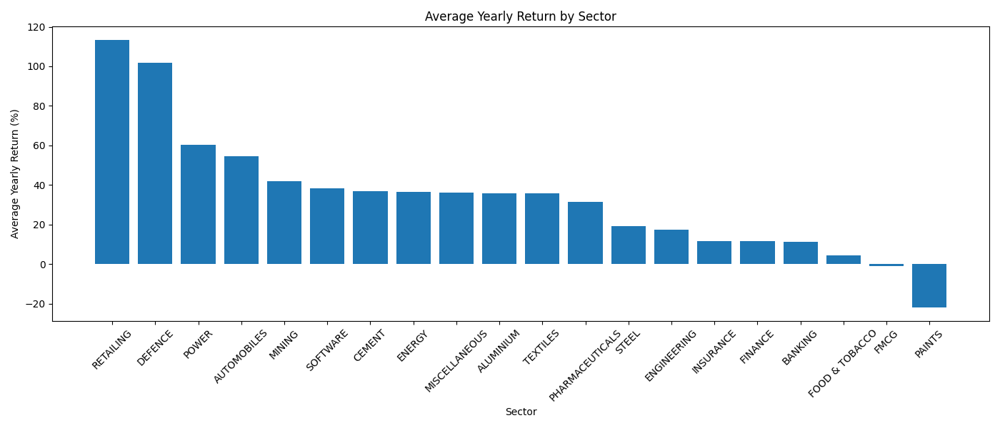

# 📈 Stock Market Analysis Dashboard

An end-to-end Stock Market Analysis project built using **Python, Pandas, Streamlit, Plotly, and Power BI** for performing stock data extraction, cleaning, analysis, visualization, and dashboard development.

---

# 🚀 Project Overview

This project analyzes stock market data and provides interactive dashboards to visualize:

- Stock Closing Price Trends
- Trading Volume Analysis
- Daily Returns
- Volatility Analysis
- Cumulative Returns
- Correlation Heatmaps
- Sector-wise Performance

The project also includes:
- ETL pipeline
- Data cleaning scripts
- Analytical reports
- Interactive Streamlit dashboard
- Power BI dashboard

---

# 🛠️ Technologies Used

## Programming & Data Analysis
- Python
- Pandas
- NumPy

## Data Visualization
- Matplotlib
- Seaborn
- Plotly

## Dashboard Development
- Streamlit
- Power BI

## Database & ETL
- SQL
- SQLAlchemy
- MySQL Connector

---

# 📂 Project Structure

```bash
stock-analysis-project/
│
├── data/
│   ├── raw_yaml/
│   ├── extracted_csv/
│   └── final_processed/
│
├── outputs/
│   ├── charts/
│   ├── reports/
│   └── screenshots/
│
├── scripts/
│   ├── extract_yaml.py
│   ├── clean_data.py
│   ├── analysis.py
│   ├── volatility_analysis.py
│   ├── cumulative_return.py
│   └── sector_analysis.py
│
├── streamlit_app/
│   └── app.py
│
├── powerbi/
│   └── stock_market_dashboard.pbix
│
├── sql/
│   └── stock_queries.sql
│
├── requirements.txt
└── README.md
```

---

# 📊 Features

## ✅ Data Extraction
- Extract stock market data from YAML files
- Convert raw files into CSV datasets

## ✅ Data Cleaning
- Handle missing values
- Remove duplicate records
- Format columns and data types

## ✅ Exploratory Data Analysis
- Average stock price analysis
- Market summary generation
- Volume trend analysis
- Sector-wise performance comparison

## ✅ Visualization
- Volatility charts
- Correlation heatmaps
- Cumulative return analysis
- Daily return visualization

## ✅ Interactive Dashboards

### 🔹 Streamlit Dashboard
- Interactive stock selection
- Price trend analysis
- Volume analysis
- Daily return tracking
- Data table visualization

### 🔹 Power BI Dashboard
- KPI Cards
- Line Charts
- Volume Analysis
- High vs Low Comparison
- Interactive Filters & Slicers

---

# 📈 Key Analyses Performed

## 🔹 Volatility Analysis
Identified highly volatile stocks using standard deviation of returns.

## 🔹 Cumulative Return Analysis
Calculated cumulative returns of top-performing stocks over time.

## 🔹 Correlation Heatmap
Visualized stock relationships and correlations.

## 🔹 Sector Analysis
Compared yearly average returns across sectors.

---

# ⚙️ Installation & Setup

## 1️⃣ Clone the Repository

```bash
git clone https://github.com/rajdeepsen/stock-analysis-project.git
cd stock-analysis-project
```

---

## 2️⃣ Create Virtual Environment

```bash
python -m venv venv
```

### Activate Environment

### Windows
```bash
venv\Scripts\activate
```

### Mac/Linux
```bash
source venv/bin/activate
```

---

## 3️⃣ Install Dependencies

```bash
pip install -r requirements.txt
```

---

# ▶️ Running the Project

## Run Data Extraction

```bash
python scripts/extract_yaml.py
```

## Run Data Cleaning

```bash
python scripts/clean_data.py
```

## Run Analysis

```bash
python scripts/analysis.py
```

## Run Volatility Analysis

```bash
python scripts/volatility_analysis.py
```

## Run Cumulative Return Analysis

```bash
python scripts/cumulative_return.py
```

## Run Sector Analysis

```bash
python scripts/sector_analysis.py
```

---

# 🌐 Run Streamlit Dashboard

```bash
streamlit run streamlit_app/app.py
```

Dashboard URL:

```bash
http://localhost:8501
```

---

# 📊 Power BI Dashboard

Open the Power BI file:

```bash
powerbi/stock_market_dashboard.pbix
```

using **Power BI Desktop**.

---


## 📊 Dashboard & Visualization Screenshots

### 🔥 Streamlit Dashboard

#### Main Dashboard


#### Daily Returns & Data Table


---

### 📈 Power BI Dashboard


---

## 📉 Advanced Stock Analysis Visualizations

### Correlation Heatmap



---

### Cumulative Return of Top Performing Stocks



---

### Sector-wise Average Yearly Return



---

### Top 10 Most Volatile Stocks

.png)


---

# 📌 Future Improvements

- Live stock market API integration
- Machine Learning stock prediction
- Technical indicators (RSI, MACD)
- Candlestick chart visualization
- Portfolio optimization
- Real-time dashboard updates

---

# 🎯 Learning Outcomes

Through this project:
- Built a complete ETL pipeline
- Performed financial data analysis
- Created interactive dashboards
- Learned Streamlit & Power BI integration
- Improved data visualization skills

---

# 👨‍💻 Author

## Rajdeep Sen

### Skills:
- Python
- Data Analytics
- Power BI
- Streamlit
- SQL
- Data Visualization

---

# ⭐ Support

If you found this project useful, consider giving it a ⭐ on GitHub.